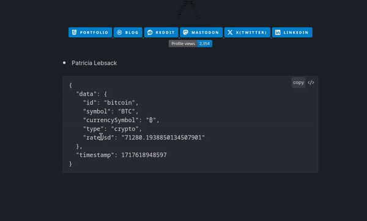

# APIR - APIRequest

[](https://rooyca.github.io/obsidian-api-request/)
[](https://obsidian.md/plugins?id=api-request)
[](https://github.com/rooyca/obsidian-api-request/releases/latest)


[](README.md)
[](README.zh.md)


Este plugin para [Obsidian](https://obsidian.md/) permite a los usuarios realizar solicitudes API directamente desde sus notas y mostrar las respuestas en bloques de código.

## 🔒 Seguridad

Este plugin implementa medidas de seguridad completas que incluyen:

- Validación de entradas para URLs, rutas y datos de usuario
- Prevención de XSS mediante sanitización de HTML
- Protección contra ataques de directory traversal
- Evaluación segura de expresiones JSONPath
- Manejo seguro de localStorage

## 🚀 Instalación

Este plugin se puede instalar desde Obsidian.

### Navegador de plugins de la comunidad de Obsidian

- Ve a `Configuración` -> `Plugins de la comunidad`
- Asegúrate de que el `Modo restringido` esté **desactivado**
- Haz clic en `Explorar`
- Busca `APIRequest`
- Haz clic en `Instalar` y luego en `Activar`

## 🛠️ Uso

### [Leer la documentación](https://rooyca.github.io/obsidian-api-request/)



## ✅ Por hacer

> Consulta todos los cambios en [TODOS-v2.md](TODOS-v2.md)

- [ ] Traducir (y actualizar) documentación
- [x] Reutilización de datos (sintaxis `{{ls.UUID>JSONPath}}`, donde `ls` significa `localStorage`)
- [x] Soporte para comentarios usando sintaxis `#` o `//`
- [x] Consulta en línea desde la respuesta (usando **Dataview**)
- [ ] Añadir pruebas (!!!)
- [ ] Re-implementar flag `repeat` (repetir solicitudes X veces o cada X segundos)
- [x] Mejoras de seguridad (validación de entradas, prevención de XSS, protección contra directory traversal)
- [x] Mejoras de seguridad de tipos TypeScript
- [x] Manejo completo de errores

## 🤝 Contribuir

¡Las contribuciones son bienvenidas! Por favor, lee nuestras [Guías de Contribución](CONTRIBUTING.md) antes de enviar un pull request.

### Desarrollo

```bash
# Instalar dependencias
npm install

# Compilar
npm run build

# Modo desarrollo (auto-recompilación)
npm run dev
```

Para más detalles, consulta [CONTRIBUTING.md](CONTRIBUTING.md).

## 🔒 Mejores Prácticas de Seguridad

Al usar este plugin:

1. **Usa HTTPS**: Siempre usa URLs HTTPS para solicitudes API
2. **Protege las Claves API**: Almacena las claves API en variables globales, nunca en las notas
3. **Revisa Datos en Caché**: Limpia regularmente respuestas antiguas en caché
4. **Valida Fuentes**: Solo conéctate a endpoints API de confianza

## ❤️ Patrocinadores

<a href="https://github.com/tlwt"></a>

## ✍️ Comentarios y Contribuciones

Si encuentras algún problema o tienes comentarios sobre el plugin, no dudes en abrir un issue en el [repositorio de GitHub](https://github.com/Rooyca/obsidian-api-request). 

¡Las contribuciones también son bienvenidas!
