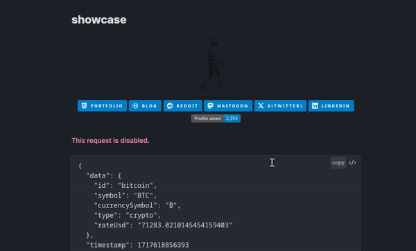
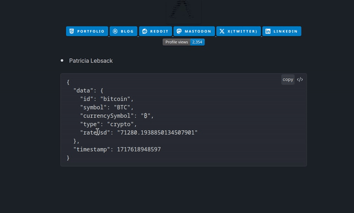
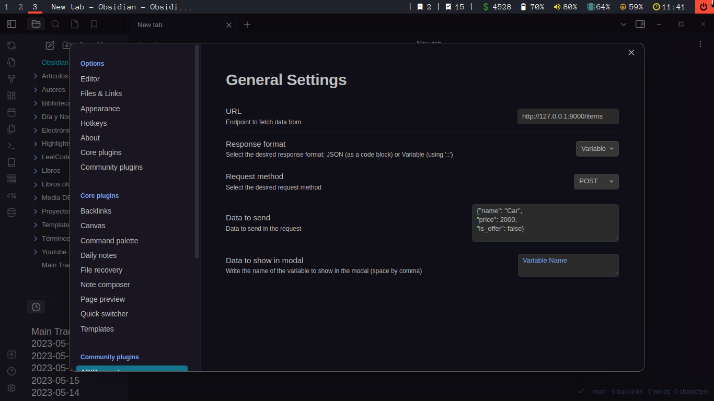

# APIR - APIRequest


[](https://github.com/rooyca/obsidian-api-request/releases/latest)
[](https://obsidian.md/plugins?id=api-request)
[](https://rooyca.github.io/obsidian-api-request/)



[Obsidian](https://obsidian.md/) plugin that allows you to make requests to APIs or any other URL and display the response in a code-block. 

## Installation

The plugin can be installed from within Obsidian.

### Obsidian Community Plugin Browser

- Go to `Settings` -> `Community plugins`
- Make sure `Restricted mode` is **off**
- Click `Browse`
- Search for `APIRequest`
- Click `Install` and then `Enable`

## Usage

[Read documentation](https://rooyca.github.io/obsidian-api-request/)

<details>
  <summary>Quick Guide</summary>
There are two ways to use the plugin:

### With Code-blocks



To use it, create a code-block with the language set to `req`. Inside the code-block, you can specify `url`, `method`, `body`, `headers`, `format`, etc. [Check docs](https://rooyca.github.io/obsidian-api-request/codeblocks/).

```req
url: https://api.chess.com/pub/player/hikaru/stats
show: chess_daily -> last -> rating
```
Multiple outputs can be displayed: 

```req
url: https://api.chess.com/pub/player/hikaru/stats
show: chess_daily -> last -> rating, chess_daily -> best -> rating
format: <p>Last game: {}</p> <strong>Best game: {}</strong>
```

It's possible to loop over an array. 

```req
url: https://jsonplaceholder.typicode.com/users
show: {..} -> address -> city
```

Here is a more complex example:

```req
url: https://my-json-server.typicode.com/typicode/demo/comments
format: <h1>{}</h1>
method: post
body: {"id":1}
headers: {"Accept": "application/json"}
show: id
```

Responses can be stored in `localStorage` with the `req-id` flag. 


```req
url: https://jsonplaceholder.typicode.com/users/1
show: id
req-id: id-persona
```

#### How to get responses from localStorage

For this you'll need [dataview](https://obsidian.md/plugins?id=dataview).

```dataviewjs
dv.paragraph(localStorage.getItem("req-id-persona"))
```

Is mandatory to use `req-` before whatever you defined in `req-id` flag.

You could also used inline:

`$=localStorage.getItem("req-id-persona")`

But this is a little buggy and don't work all the time. (Use this for short and unformatted responses)

#### How to remove responses from localStorage

In order to remove a response from the `localStorage` you can use the following code:

```dataviewjs
localStorage.removeItem("req-id-persona")
```
For removing all responses use:

```dataviewjs
localStorage.clear()
```
Or just go to the plugin settings and click the button `Clear ID's` to remove all responses.

### With Configuration

To use the plugin, press `Ctrl+P` and search for `APIR`. There are two options:

1. Show response in modal
2. Paste response in current document (at current line)

[Check docs](https://rooyca.github.io/obsidian-api-request/settings/).

#### Settings

The plugin has a few settings that you can configure:



- URL: The URL to send the request to.
- Method: Choose between GET, POST, PUT & DELETE.
- Body: The data to send with the request. Data should by in JSON format.
- Headers: The header data to send with the request. Data should by in JSON format. (`{"Content-Type": "application/json", "Authorization": "Bearer TOKEN"}`)
- Response: The response data to display. If empty all data will be display. You can use a right arrow `->` to access nested objects. For example, if you want to show the `title` from the `user` object, you can do that like this: `user -> title`.
</details>

## To-do

- [x] Add more request types (POST, PUT, DELETE)
- [x] Add support for authentication
- [x] Add customization for modal output
- [ ] Save response to a file
- [ ] Inline query from response
- [ ] Predefined requests
- [ ] GUI for code-blocks

## Feedback and Contributions

If you encounter any issues or have feedback on the plugin, feel free to open an issue on the [GitHub repository](https://github.com/Rooyca/obsidian-api-request). Contributions are also welcome!
