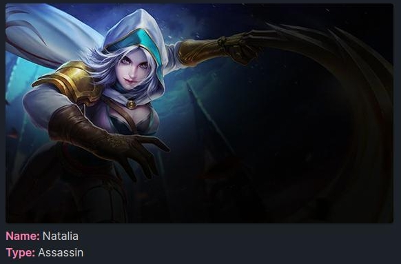

# Usecase

A collection of use cases for this plugin. **If you have a one, please share it with us.**

## Render Markdown

~~~makdown
```req
url: https://raw.githubusercontent.com/Rooyca/Rooyca/main/README.md
```
~~~

## Check BITCOIN (or any crypto) price

~~~makdown
```req 
url: api.coincap.io/v2/rates/bitcoin
show: data -> rateUsd
```
~~~

> 64992.8972508856324769

If we want to repeat this request 100 times every 5 seconds, we can do it like this:

~~~makdown
```req 
url: api.coincap.io/v2/rates/bitcoin
show: data -> rateUsd
req-repeat: 100@5
```
~~~

If we want to take this one step further and get notified when the price goes above 65000, we can do it like this:

~~~makdown
```req 
url: api.coincap.io/v2/rates/bitcoin
show: data -> rateUsd
req-repeat: 100@5
notify-if: data.rateUsd > 65000
```
~~~

!!! warning "Noted the use of `data.rateUsd` instead of `data -> rateUsd`"

## Get the weather

~~~makdown
```req
url: api.openweathermap.org/data/2.5/weather?q=<CITY>&appid=YOUR_API_KEY
show: main -> temp
```
~~~

## Search movies

~~~makdown
```req
url: https://api.themoviedb.org/3/search/movie?query={{this.title}}&api_key=YOUR_API_KEY
show: results -> {..} -> title
```
~~~

!!! info "Note the use of `{{this.title}}`. This is a feature that allows you to pass front-matter properties."

## Render data

~~~makdown
```req
url: https://mapi.mobilelegends.com/hero/detail?id={{this.file.name}}
show: data -> cover_picture, data -> name, data -> type
format:  <br> **Name:** {} <br> **Type:** {}
render
```
~~~



## Get TODOS from [todoist](https://todoist.com/)

~~~makdown
```req
url: https://api.todoist.com/rest/v2/tasks
headers: {"Authorization": "Bearer YOUR_TOKEN"}
show: {..} -> content
format: - [ ] {}
req-id: todos
render
```
~~~

!!! warning "This will save the response in localStorage under the key `req-todos`"

## Your use case

> **If you want to share your use case, please feel free to open a PR or a [Issue](https://github.com/Rooyca/obsidian-api-request/issues/new/choose).**